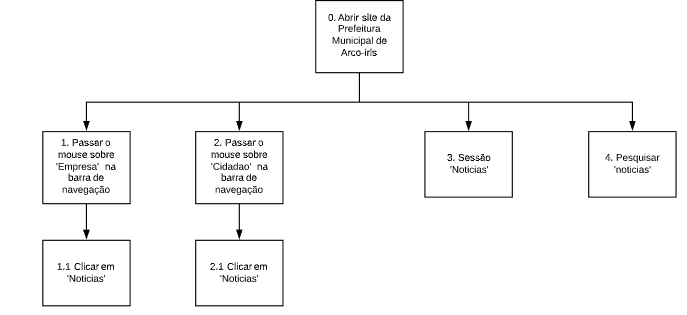
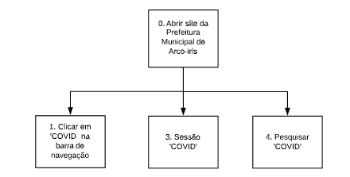

# Análise de Tarefas
## Introdução

O processo de analisar tarefas em um site trata-se de uma análise de como uma tarefa desejável é realizada pelo usuário. Isso inclui descrição detalhada tanto físicas como mentais, duração, frequência, complexidade, condições ambientais, vestimenta e equipamentos necessários.

A seguir podemos ver três atividades selecionadas para analisar. Essa são: visualizar a prestação de contas públicas, as notícias recentes sobre a cidade e as informações sobre o Corona-Vírus na cidade. Atividades encontradas como importantes no [perfil de usuário](perfil_de_usuario.md).

## Objetivos 
### Prestação de contas públicas
#### Diagrama

#### Especificação

| Operações | Problemas e recomendações |
|------|------|
| 0. Abrir site da Prefeitura Municipal de Arco-iris |  |
| 1. Passar o mouse sobre 'Transparência'  na barra de navegação |  |
| 2. Sessão 'Acesso rápido'  aba 'Transparência' |  |
| Clicar em 'Transparência em tempo real' | problema: Botão avança para outra pagina  solução: Avisar que vai avançar para outra pagina   solução: Adicionar conteúdo a pagina 'conta publicas'| 
| Clicar em 'Contas Públicas' | problema: Pagina carrega sem nenhuma informação sobre contas públicas   solução: Adicionar informações sobre a pagina   solução: Retirar pagina|
| 3. Pesquisar 'contas públicas' | problema: Pesquisa retorna nenhum resultado   solução: Melhorar pesquisa|

### Notícias recentes sobre a cidade
#### Diagrama

#### Especificação

| Operações | Problemas e recomendações |
|------|------|
| 0. Abrir site da Prefeitura Municipal de Arco-iris |  |
| 1. Passar o mouse sobre 'Empresa'  na barra de navegação |  |
| 2. Passar o mouse sobre 'Cidadão'  na barra de navegação |  |
| 3. Sessão 'Noticias' |  |
| 4. Pesquisar 'noticias' |  |
| Clicar em 'Noticias' | problema: A pagina não apresenta noticias recentes sobre a cidade solução: Atualiza conteúdo das notícias com mais frequência |

### Informações sobre o Corona-Virus na cidade
#### Diagrama

#### Especificação

| Operações | Problemas e recomendações |
|------|------|
| 0. Abrir site da Prefeitura Municipal de Arco-iris |  |
| 1. Clicar em 'COVID'  na barra de navegação | problema: Tipografia atrapalha a leitura. solução: Alterar a tipografia problema: Dados não atualizados solução: Atualizar dados da pagina  problema: Disposição da pagina incomoda e atrapalha a leitura  solução: Melhora na organização das informações da pagina|
| 2. Sessão 'COVID' | problema: Clicar nessa pagina redireciona para a pagina inicial solução: Redirecionar para a pagina de informações do COVID|
| 3. Pesquisar 'COVID' | problema: Pesquisar COVID encontra resultados de 'Legislação solução: Melhorar a pesquisa do site|

## Apresentação 

## Versionamento

| Data | Versão | Descrição | Autor |
|------|------|------|------|
|03/10/2020|0.1|Abertura do documento |Giovanna Borges Bottino|
|03/10/2020|0.2|Adiciona introdução |Giovanna Borges Bottino|
|03/10/2020|1.0|Adiciona apresentação |Giovanna Borges Bottino|
