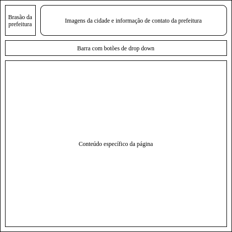
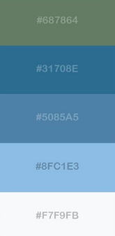
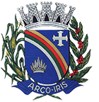

# Guia de Estilo

## 1. Introdução 

### 1.1 Objetivos do guia de estilo 

Este documento apresenta o Guia de Estilo para o site da Prefeitura Municipal de Arco-íris - SP. O Guia de Estilo tem como objetivo definir os padrões e diretrizes que guiarão o design da interface da aplicação, no que diz respeito à interação com o usuário. Os padrões estabelecidos nesse Guia servem para certificar que a consistência do design será mantida em todo o projeto.  

### 1.2 Organização e conteúdo do guia de estilo 

O presente Guia está organizado na seguinte maneira: primeiramente é apresentado os Resultados de análise, que trazem uma descrição sobre o ambiente de trabalho dos usuários do site. Depois são apresentados os Elementos de Interface, que mostram a disposição espacial e grid, as janelas, a tipografia, símbolos não tipográficos, cores e figuras. E por fim, são exibidos os Elementos de Interação, trazendo estilos de interação.

### 1.3 Público-alvo do guia de estilo 

O público-alvo do presente Guia de Estilo é a equipe que está trabalhando no presente projeto de Interação Humano Computador. 

### 1.4 Como utilizar o guia 

O Guia de Estilo deve ser utilizado como um padrão que guiará o design da interface do site. Para o time trabalhando no presente projeto, esse guia servirá como referência para o design da interface e dos padrões estabelecidos.  

O presente Guia possui uma série de orientações e regras, que devem ser consultadas e seguidas no desenvolvimento do projeto, para que seja possível alcançar uma padronização na interface do site da Prefeitura Municipal de Arco-íris - SP, assegurando a consistência, facilitando o trabalho e minimizando o tempo de trabalho da equipe, além de apresentar as diretrizes e padrões utilizados.  

### 1.5 Como manter o guia 

Sempre que uma decisão a respeito do design for tomada, o Guia de Estilo também deve ser atualizado para corresponder a tal decisão.  

## 2. Resultados de análise 

### 2.1 Descrição do ambiente de trabalho do usuário 

O projeto é feito com o site da Prefeitura Municipal de Arco-íris, que permite a interação do usuário através de cliques em elementos na tela. Tendo isso em vista, o ambiente de trabalho do usuário é qualquer navegador web que ele utilize, permitindo o acesso ao site. 

## 3. Elementos de interface

### 3.1 Disposição espacial e grid

A seguir é apresentado a disposição espacial que deve ser utilizado na página inicial do site da Prefeitura Municipal de Arco-íris - SP. 

### 3.2 Janelas 
A seguir é apresentado a disposição espacial que deve ser utilizada nas janelas do site da Prefeitura Municipal de Arco-íris - SP, o foco para as janelas é apresentar o conteúdo específico de cada página. 

### 3.3 Tipografia 
Foram preferidas fontes com serifa devido a sua maior legibilidade. A escolha para a fonte vai depender da sua aplicação na página, mantendo um limite de duas ou três fontes por página. Não iremos utilizar fontes piscantes ou coloridas em nenhum momento, caso seja necessário a atenção do leitor deve-se usar itálico ou negrito. 
Helvetica Light 
Deve ser usada fora de documentos e textos longos, como os botões de navegação entre páginas 
Arial 
Deve ser usada junto a fonte Helvetica para elementos de navegação entre páginas e textos curtos. 
Times New Roman 
Deve ser usada em documentos ou textos longos  

### 3.4 Símbolos não tipográficos 

No design do site da Prefeitura Municipal de Arco-íris devem ser utilizados os seguintes símbolos não tipográficos: 

**Sucesso** : esse simbolo deve ser usado para indicar que uma ação foi concluída com sucesso.

 

**Erro** : esse simbolo deve ser usado para indicar uma falha em alguma ação performada no sistema.

 

**Atenção** : esse simbolo deve ser usado para demonstrar campos obrigatórios e para chamar a atenção do usuário quando necessário.

 

### 3.5 Cores 

No design do site da Prefeitura Municipal de Arco-íris deve ser utilizada a seguinte paleta de cores:

 

### 3.6 Figuras 

No design do site da Prefeitura Municipal de Arco-íris também é recorrente o uso do brasão da cidade como elemento visual.

 

## 4. Elementos de interação 

### 4.1 Estilos de interação 

Serão utilizados na interação do usuário com a interface os seguintes elementos: 

- **Botões:** serão utilizados em interações de clique. 
- **Menu Dropdown:** será utilizado na barra de informações. 
- **Caixa de texto:** será utilizado no mecanismo de busca do site. 

## Versionamento

| Data | Versão | Descrição | Autor |
|------|------|------|------|
|14/10/2020|0.1|Adiciona Introdução e Resultados|Gabrielle Ribeiro Gomes|
|14/10/2020|0.2|Adiciona Elementos de interface|Gustavo Afonso Pires Severo|
|14/10/2020|0.3|Corrigindo tamanho das imagens e adicionando brasão da cidade |Gustavo Afonso Pires Severo|
|14/10/2020|1.0|Adicionando elementos de interação|Gabrielle Ribeiro Gomes|
