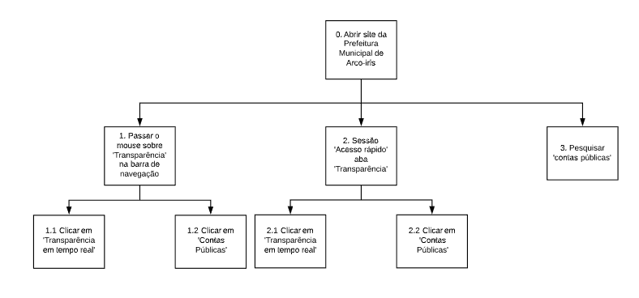
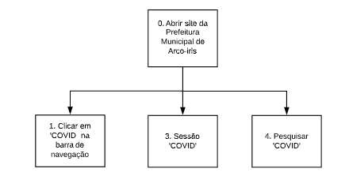

# Análise de Tarefas
## Introdução

O processo de analisar tarefas em um site trata-se de uma análise de como uma tarefa desejável é realizada pelo usuário. Isso inclui descrição detalhada tanto físicas como mentais, duração, frequência, complexidade, condições ambientais, vestimenta e equipamentos necessários.

A seguir podemos ver três atividades selecionadas para analisar. Essa são: visualizar a prestação de contas públicas, as notícias recentes sobre a cidade e as informações sobre o Coronavírus na cidade. Atividades encontradas como importantes no [perfil de usuário](./../analise_de_requisitos/perfil_de_usuario.md).

Essa primeira versão foi feita através do método de inspeção, já está tem como objetivo verificar se os usuários estão de acordo ou não com o que foi selecionado. Essas tarefas foram refatoradas com base na [entrevista](entrevista_tarefas.md) feitas com as [personas](./../analise_de_requisitos/personas.md) selecionadas.

## Objetivos 
### Prestação de contas públicas
#### Diagrama

#### Especificação

| Operações | Problemas e recomendações |
|------|------|
| 0. Abrir site da Prefeitura Municipal de Arco-íris |  |
| 1. Passar o mouse sobre 'Transparência'  na barra de navegação |  |
| 2. Sessão 'Acesso rápido'  aba 'Transparência' |  |
| Clicar em 'Transparência em tempo real' | **Problema**: Botão avança para outra página  **Solução**: Adicionar conteúdo a página 'contas públicas'| 
| Clicar em 'Contas Públicas' | **Problema**: Página carrega sem nenhuma informação sobre contas públicas   **Solução**: Adicionar informações sobre a página |
| 3. Pesquisar 'contas públicas' |**Problema**: Pesquisa retorna nenhum resultado  **Solução**: Melhorar pesquisa|

### Notícias recentes sobre a cidade
#### Diagrama

#### Especificação

| Operações | Problemas e recomendações |
|------|------|
| 0. Abrir site da Prefeitura Municipal de Arco-íris |  |
| 1. Passar o mouse sobre 'Empresa'  na barra de navegação |  |
| 2. Passar o mouse sobre 'Cidadão'  na barra de navegação |  |
| 3. Sessão 'Notícias' | **Problema**: A página não apresenta notícias recentes sobre a cidade **Solução**: Atualizar conteúdo das notícias com mais frequência |
| 4. Pesquisar 'Notícias' | **Problema**: A página não apresenta todas as notícias do site **Solução**: Apresentar todas as notícias do site |
| Clicar em 'Notícias' | **Problema**: A página não apresenta notícias por filtro cidadão/empresa **Solução**: Atualizar conteúdo das notícias com mais frequência |

### Informações sobre o Coronavírus na cidade
#### Diagrama

#### Especificação

| Operações | Problemas e recomendações |
|------|------|
| 0. Abrir site da Prefeitura Municipal de Arco-íris |  |
| 1. Clicar em 'COVID'  na barra de navegação | **Problema**: Tipografia atrapalha a leitura. **Solução**: Alterar a tipografia  **Problema**: Dados não atualizados **Solução**: Atualizar dados da página   **Problema**: Disposição da página incomoda e atrapalha a leitura  **Solução**: Melhora na organização das informações da página|
| 2. Sessão 'COVID' | **Problema**: Clicar nessa página redireciona para a página inicial **Solução**: Redirecionar para a página de informações do COVID|
| 3. Pesquisar 'COVID' | **Problema**: Pesquisar COVID encontra resultados de 'Legislação' **Solução**: Melhorar a pesquisa do site|

## Conclusão
Após a coleta de dados nas entrevistas feitas com as personas foi possível ver que adicionamos informações em excesso para a atividade. Algumas atividades tiveram o padrão repetido já outra não, conseguindo utilizar todos os caminhos apresentados. O documento foi refatorado e atualizado com novas informações das entrevistas 
## Versionamento

| Data | Versão | Descrição | Autor |
|------|------|------|------|
|03/10/2020|0.1|Abertura do documento |Giovanna Borges Bottino|
|03/10/2020|0.2|Adiciona introdução |Giovanna Borges Bottino|
|03/10/2020|1.0|Adiciona apresentação |Giovanna Borges Bottino|
|05/10/2020|1.1|Corrige ortografia|Gabrielle Ribeiro Gomes|
|04/11/2020|1.2|Atualiza com informações das entrevistas|Giovanna Borges Bottino|
