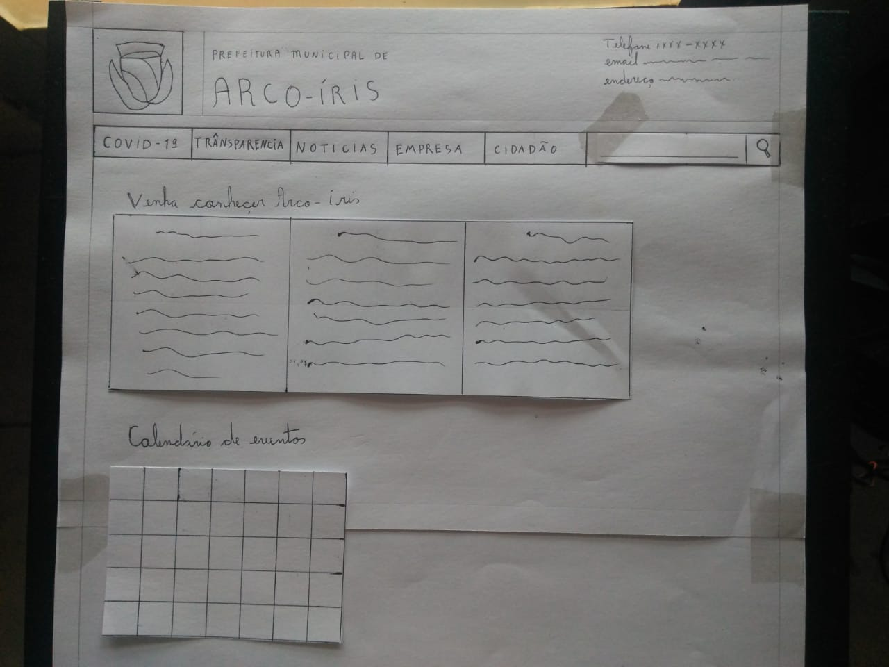
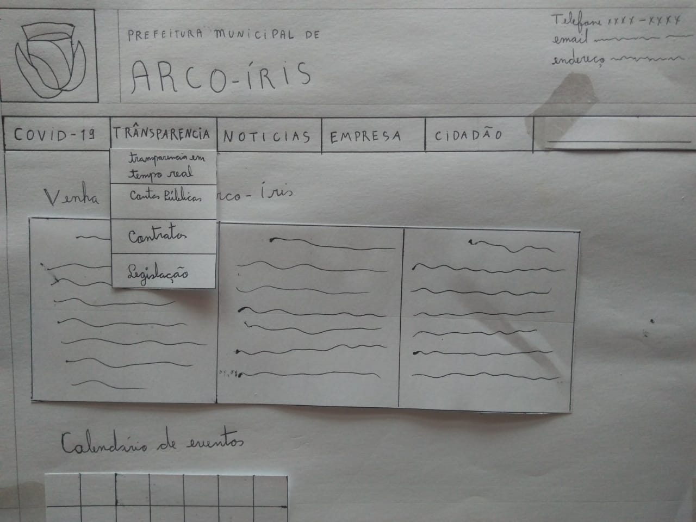
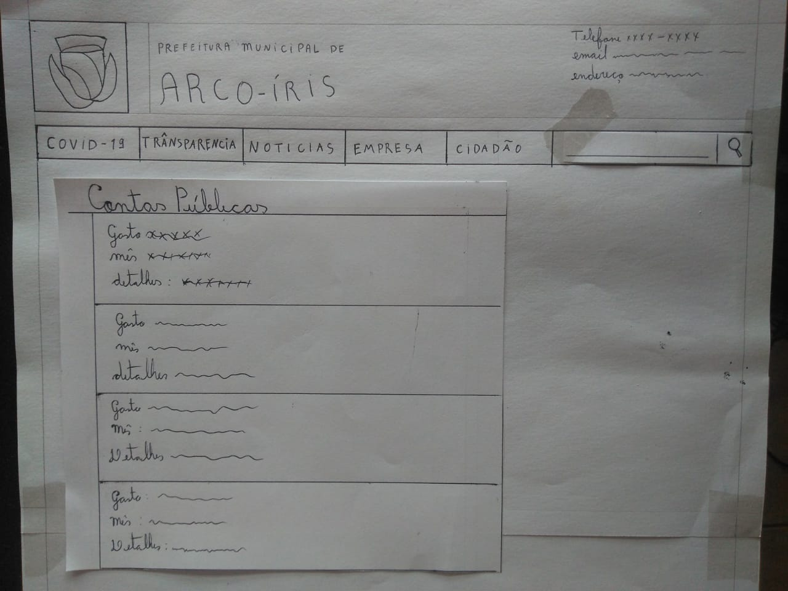
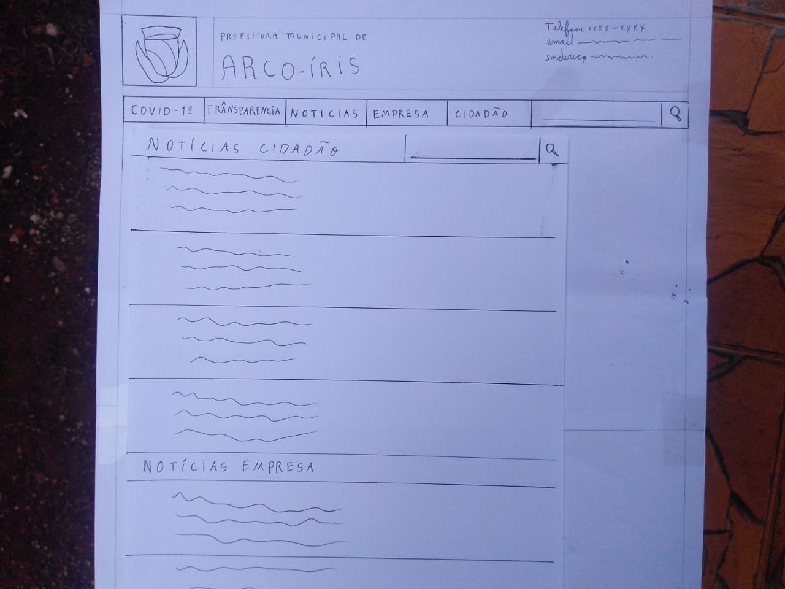
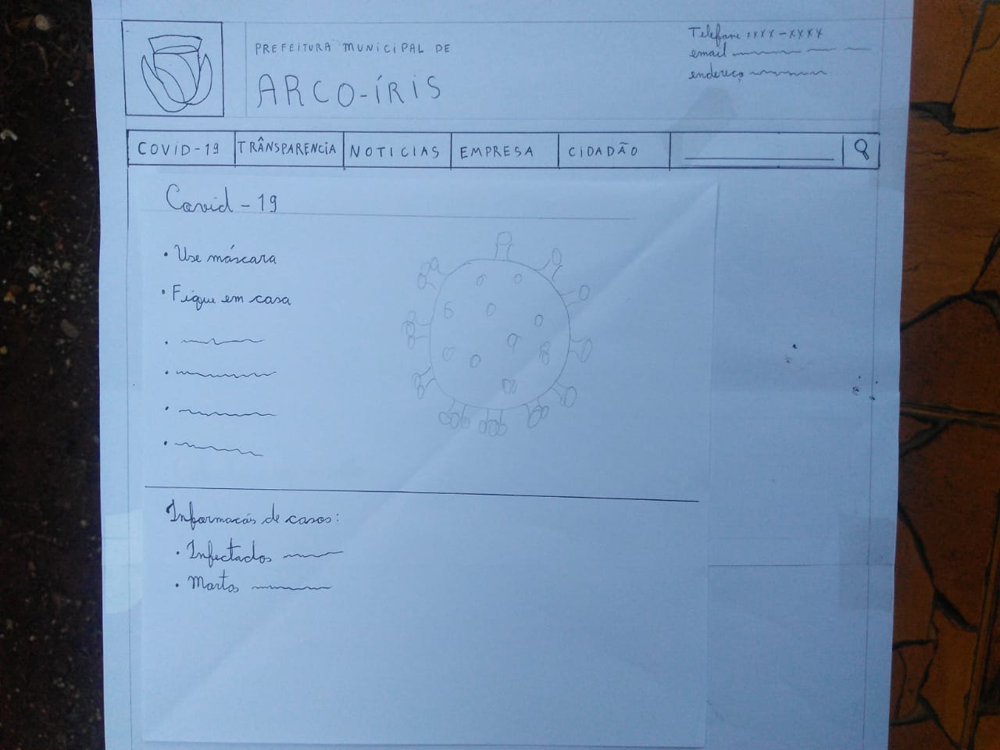

# Prototipação em papel 

Os protótipos são ferramentas que possibilitam que os stakeholders interajam com um produto imaginado visando a adquirir alguma experiência de como utilizá-lo em um ambiente real e a explorar os usos para ele imaginados.  

Um protótipo de baixa fidelidade é aquele que não se assemelha muito ao produto final; ele utiliza, por exemplo, materiais muito diferentes da versão final pretendida, como papel e cartolina, em vez de telas eletrônicas e metal.  

Os protótipos de baixa-fidelidade são uteis porque tendem a ser simples, baratos e de rápida produção. Isso também significa que podem ser rapidamente modificados, oferecendo, portanto, suporte à exploração de designs e ideias alternativas. 

Nessa fase do projeto, foi utilizado **protótipos em papel**. O método de prototipação em papel, é um tipo de prototipação de baixa fidelidade que avalia a usabilidade de um design de IHC representado em papel, através de simulações de uso com a participação de potenciais usuários. Simular o uso em papel é um modo rápido e barato de identificar problemas de usabilidade antes mesmo de construir uma solução de IHC executável.  Ele permite avaliar facilmente soluções parciais, que não cobrem toda a interface com usuário, e soluções de baixa e média fidelidade, que ainda não definem todos os detalhes da interface. 

## Protótipos em papel
Os protótipos em papel apresentados a seguir correspondem às três tarefas apresentadas anteriormente na análise de tarefas, sendo elas: prestação de contas públicas, notícias recentes sobre a cidade e informações sobre o Coronavírus na cidade.

### Homepage

A página inicial do nosso protótipo segue o que foi definido na guia de estilo, em comparação com o site antigo ela tem menos botões na barra de navegação e todos os conteúdos duplicados foram retirados.

<td> 

### Prestação de contas públicas

Para acessar a página de contas públicas basta o usuário acionar o dropdown de transparencia e clicar no botão de contas públicas.

<td>

Assim que o botão for acionado o usuário vai ser redirecionado para a página de contas públicas, onde as contas estarão listadas de forma clara.

<td> 

### Notícias recentes sobre a cidade

Para acessar as notícias da cidade basta o usuário clicar no botão de notícias, em seguida o sistema vai exibir as notícias da cidade bem como uma caixa de busca para o caso do usuário querer buscar uma notícia em específico.

<td> 

### Informações sobre o Corona vírus na cidade

Para acessar as informações do corona vírus o usuário deve apenas clicar no botão covid-19 na barra de navegação e será redirecionado para a página de informações sobre o covid.

<td> 

## Referências 

SHARP, Helen; et al. Design de interação. Bookman, 2005. 

BARBOSA, Simone; SILVA, Bruno. Interação Humano-Computador. Rio de Janeiro: Elsevier, 2010. 

## Versionamento

| Data | Versão | Descrição | Autor |
|------|------|------|------|
|04/11/2020|0.1|Adiciona referencial teórico|Gabrielle Ribeiro Gomes|
 |04/11/2020|0.2|Adiciona imagens do protótipo em papel|Gustavo Afonso Pires Severo|