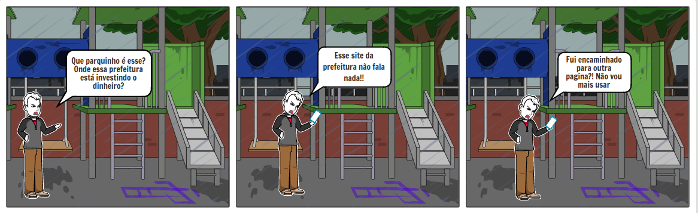
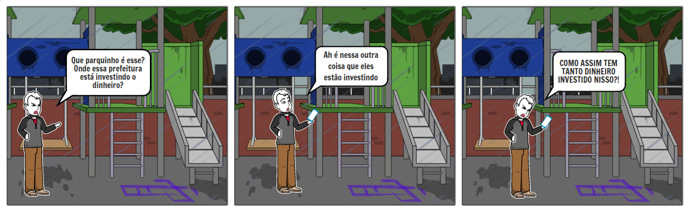
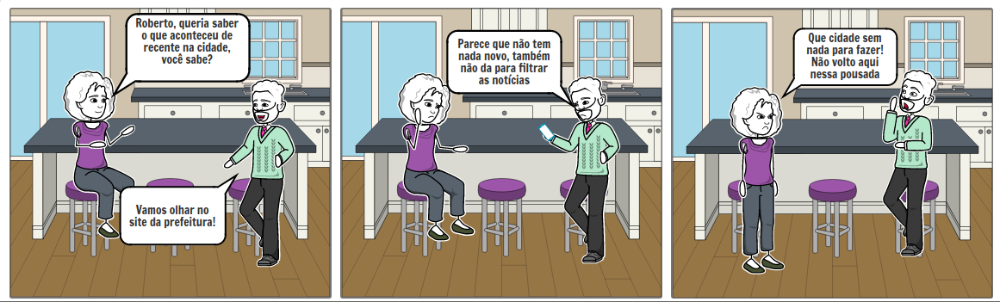
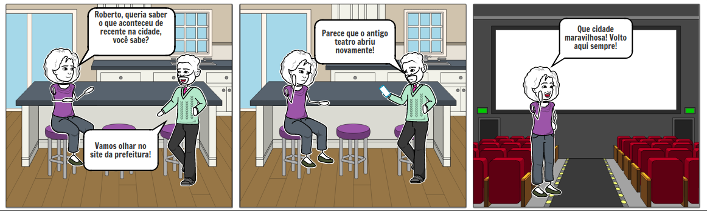
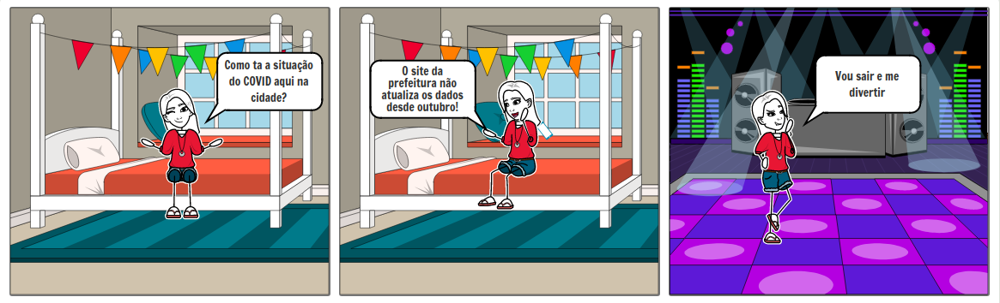
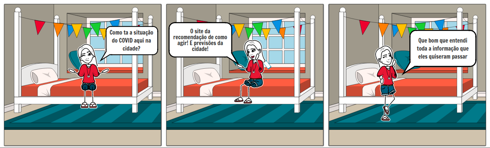

# Storyboard
## Introdução

 O Storyboard é uma técnica de prototipação de baixa-fidelidade, que  tem como objetivo trazer uma pré-visualização do ambiente e das pessoas envolvidas, utilizando uma sequência de ilustrações, que representam os estados da interface do sistema ao longo do caminho de interação com o usuário do sistema. Sendo utilizado juntamente com possíveis cenários e histórias de usuários, que auxiliam representar de maneira visual o usuário realizando uma tarefa do sistema.
 
 Segundo Mayhew (1999), são quatro parâmetros que definem a fidelidade de um protótipo, detalhamento, grau de funcionalidade, similaridade de interação e refinamento estético. Sendo o storyboards um protótipo de baixa-fidelidade, inserido no ciclo de desenvolvimento de um software, o seu foco não está na parte estética e também não está em representar o produto desenvolvido por completo, e sim em ilustrar um visão geral da interação do cliente sobre diferentes perspectivas, permitindo melhor entendimento e resolução de problemas.

A seguir podemos ver as três atividades selecionadas de forma a se entender em um storyboard. Essa são: visualizar a prestação de contas públicas, as notícias recentes sobre a cidade e as informações sobre o Coronavírus na cidade. Atividades encontradas como importantes no [perfil de usuário](perfil_de_usuario.md) e explicadas detalhamente em [análise de tarefas](analise_de_tarefas.md).

## Objetivos 

### Prestação de contas públicas

Podemos observar o José Leitão Lemos, nossa primeira persona observando o descaso da prefeitura com o parquinho. Por isso ele decide ver como a prefeitura está usando o dinheiro, através da prestação de contas públicas. A tirinha termina com ele irritado em ambas as situações, no primeiro momento por não encontrar as informações e no segundo por não concordar em como a prefeitura está gastando o dinheiro. 
#### Como é

#### Como deveria ser

## Avaliação SB01

### Notícias recentes sobre a cidade

Podemos observar o Roberto Cardoso de Jesus, nossa quarta persona conversando com uma cliente de sua pousada. Ela pergunta o que teria para fazer na cidade. Por isso ele decide ver as notícias recentes da cidade. A tirinha termina com a cliente irritada na primeira situação, pois não há nada para fazer na cidade. Já na segunda situação ela está feliz indo ao teatro reformado.  
#### Como é

#### Como deveria ser

## Avaliação SB02

### Informações sobre o Coronavírus na cidade

Nesse último storyboard vemos Sara Castro Cavalcanti nossa persona que é estudante em seu quarto querendo sair e se divertir. Por isso ela decide analisar a previsão da cidade sobre o coronavírus e como se precaver. A tirinha termina com ela saindo, pois, não entendeu nada no site, e também tinha muita informação desatualizada. Na segunda situação está mais consciente das informações e sabe o que deve e não fazer, pois, entende como irá funcionar em breve.

#### Como é

#### Como deveria ser

## Avaliação SB03

## Versionamento

| Data | Versão | Descrição | Autor |
|------|------|------|------|
|26/10/2020|0.1|Abertura do documento |Giovanna Borges Bottino|
|26/10/2020|0.2|Adiciona introdução |Giovanna Borges Bottino|
|26/10/2020|1.0|Adiciona objetivos |Giovanna Borges Bottino|
|26/10/2020|1.1|Adiciona informações faltando da avaliação do Storyboard |Luiz Gustavo Dias Paes Pinheiro|
