# Perfil de usuário
Os perfis de usuário contribuem para registrar o entendimento sobre os usuários do produto. Dessa forma, eles também facilitam a criação de [personas](personas.md).
O perfil de usuário é uma descrição das características dos usuários onde, a partir da coleta de dados, são traçados perfis de usuários de características semelhantes e calcula-se a proporção de usuários que se encaixam em cada perfil.

## Questionário
Para coletar dados sobre usuários, a equipe elaborou um questionário no *Google Forms*.
* Dados colhidos de 30/09/2020 até 02/10/2020
* Respostas de 63 participantes
* Coleta de dados gerais sobre os participantes e dados direcionados sobre sua interação com *site* da prefeitura/administração da sua cidade

### Resultados
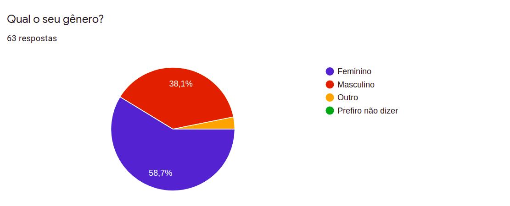 
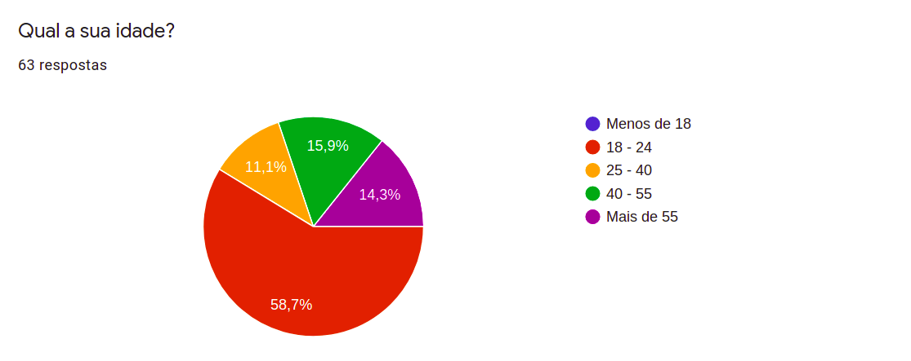
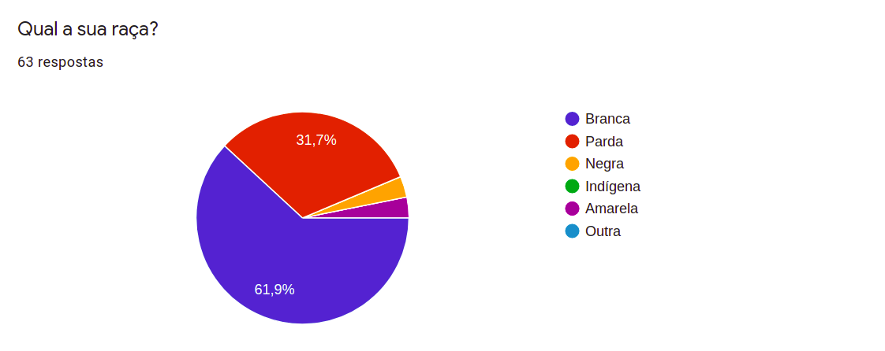
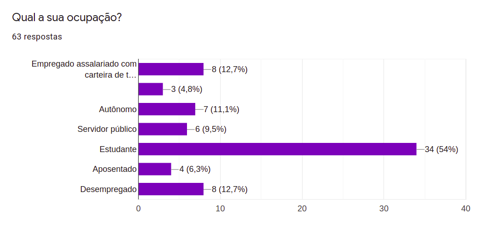
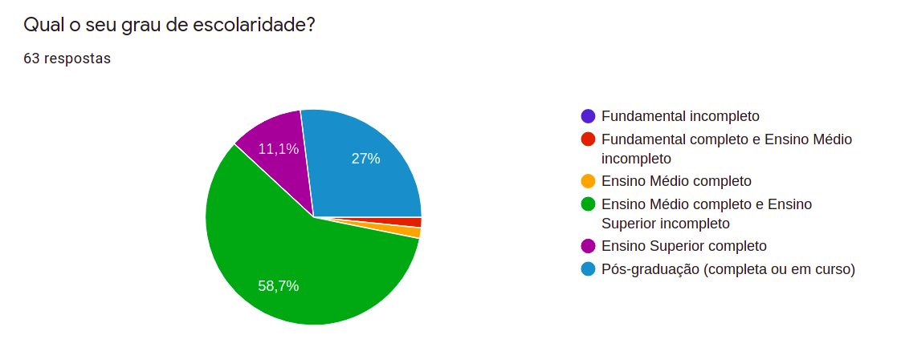
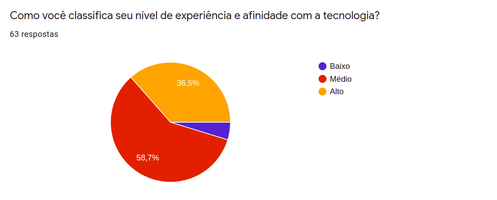
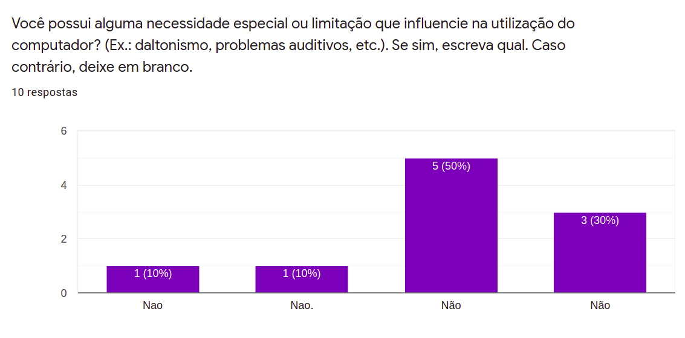
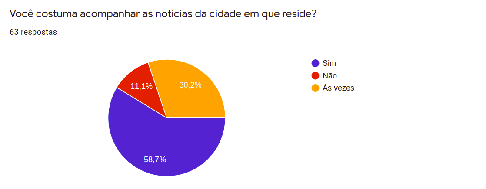
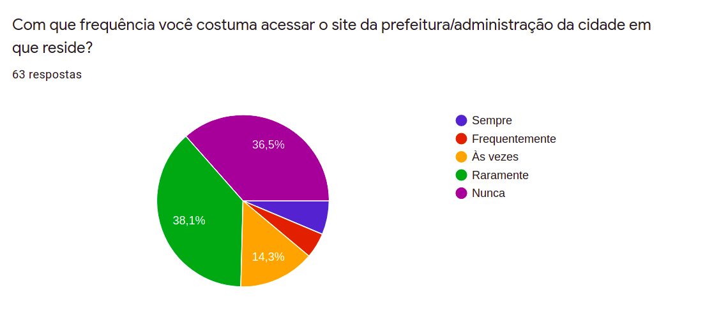
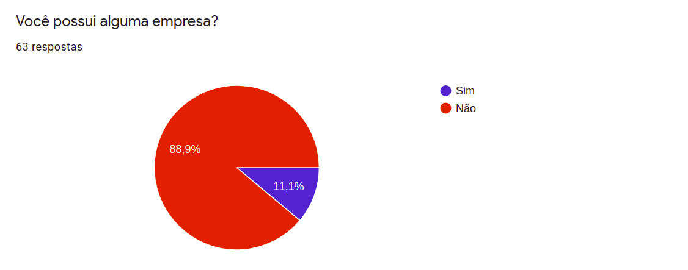
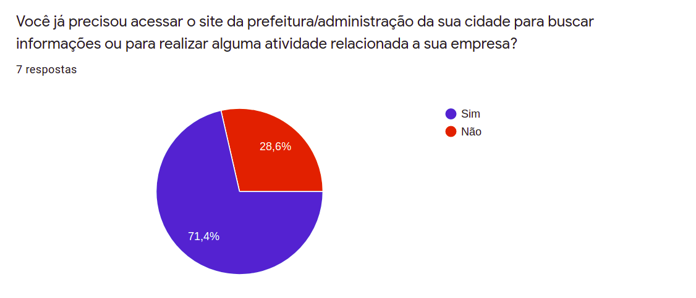
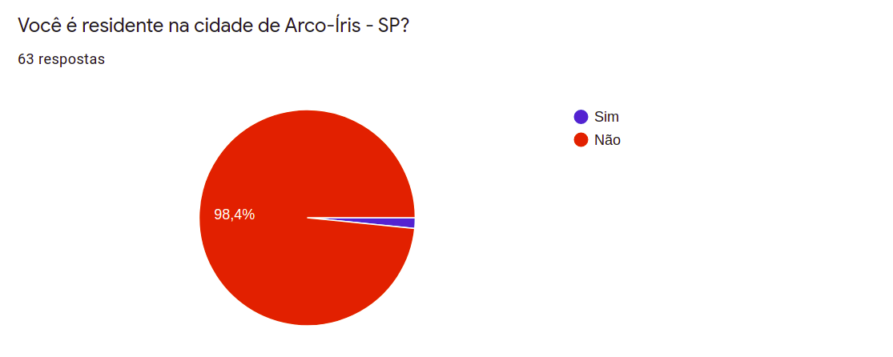
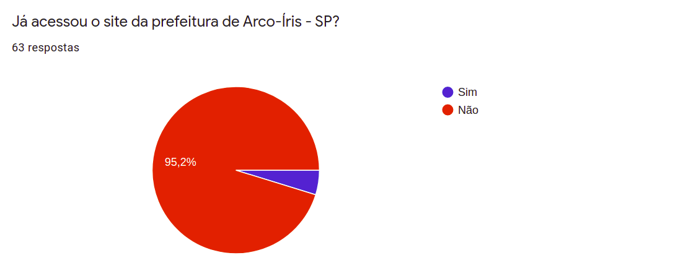
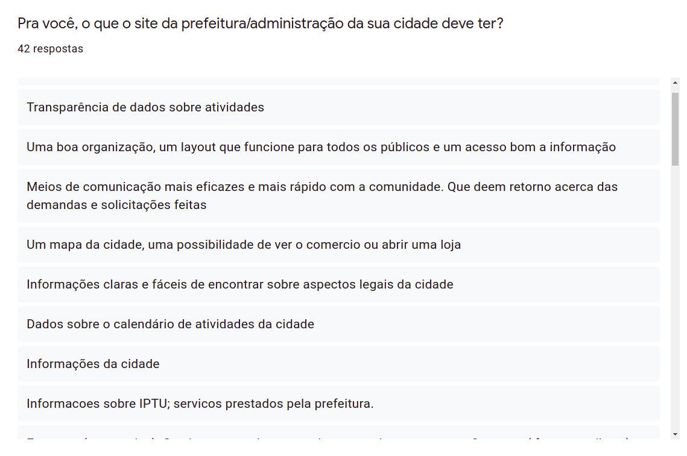
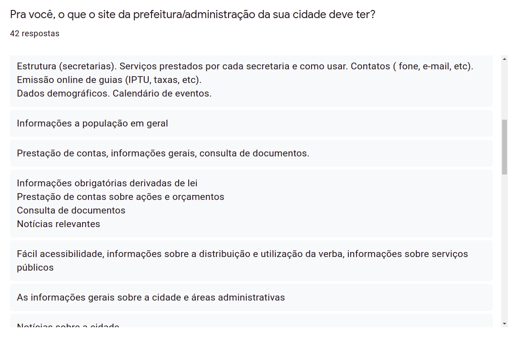

## Análise
A partir dos dados coletados, alguns valores foram agregados em grupos para uma melhor análise de tipos de perfil dos usuários.

##### **Faixa etária**  
* **18 - 24 anos**: são, em sua maioria, estudantes, com **alto** nível de afinidade com a tecnologia, costumam **às vezes** acompanhar as notícias da sua cidade, porém **raramente** acessam o *site* da prefeitura/administração.  
* **25 - 40**: são, em sua maioria empregados assalariados, com **médio** nível de afinidade com a tecnologia, costumam acompanhar as notícias da cidade, porém **raramente** acessam o *site* da prefeitura/administração.  
* **41 - 55**: são, em sua maioria, servidores públicos ou empregados assalariados com carteira de trabalho, com **médio** nível de afinidade com a tecnologia, costumam acompanhar as notícias da sua cidade e, em média, **sempre** ou **frequentemente** acessam o *site* da prefeitura/administração.  
* **Mais de 55**: são, em sua maioria autônomos ou aposentados, com **baixo/médio** nível de afinidade com a tecnologia, costumam acompanhar as notícias da cidade, porém **raramente** acessam o *site* da prefeitura/administração.  

##### Outras características
* Os participantes que costumam acessar o *site* da prefeitura/administração **sempre** e **frequentemente**, possuem nível **médio** de afinidade com a tecnologia e **acompanham** as notícias da sua cidade.

* Dos 7 participantes que **possuem empresa**, 5 já precisaram acessar o site da prefeitura/administração da cidade para buscar informações ou para realizar alguma atividade relacionada a sua empresa.

* "Pra você, o que o site da prefeitura/administração da sua cidade deve ter?". Os participantes consideram bastante:
  * Notícias recentes sobre a cidade
  * Dados sobre o calendário de atividades
  * Informações sobre IPTU
  * Mapa da cidade e informações gerais sobre ela
  * Informações sobre a cidade para turistas, telefones úteis
  * Informações obrigatórias derivadas de lei
  * Prestação de contas sobre ações e orçamentos

## Referências
BARBOSA, Simone; SILVA, Bruno. Interação Humano-Computador. Rio de Janeiro: Elsevier, 2010.

## Versionamento
| Data | Versão | Descrição | Autor |
|------|------|------|------|
|02/10/2020|0.1|Adicionando resultados do questionário e perfil de usuário|Aline Helena Lermen|